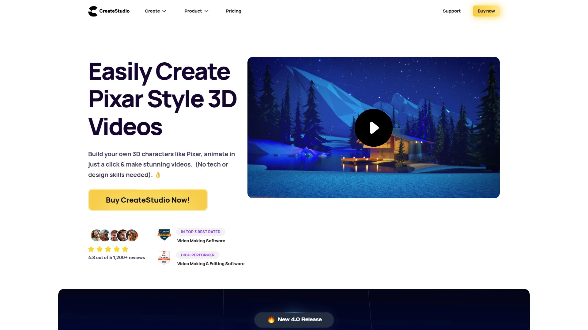

# Top 15 Best Video Animation Software Tools in 2025

You sit there staring at a blank screen, knowing you need video content but feeling completely stuck. Maybe you've got a product to explain, a story to tell, or a brand message that needs some visual punch. But here's the reality check—hiring an animator costs thousands, learning After Effects takes months, and your deadline is basically yesterday.

The good news is that video animation software has genuinely evolved past the point where you need design skills or technical wizardry. The platforms below let you drag, drop, click, and actually create something that looks professional within hours, not weeks. Whether you're building 3D explainer videos, social media ads with scroll-stopping effects, or whiteboard animations for training content, there's a tool here that matches how you actually work—not how software engineers think you should work.

***

## **[CreateStudio](https://createstudio.com)**

The drag-and-drop 3D animation powerhouse that lets you build Pixar-style characters and explainer videos without touching a single line of code or learning complex rigging.

CreateStudio tackles the biggest pain point in video animation—making professional content without years of training. The software uses a point-and-click system where you can build custom 3D characters with over 52 million possible combinations, animate them instantly, and even add your own face to create bobblehead videos. Everything from character movements to text animations happens through preset options rather than manual keyframe adjustments.

The platform includes multiple animation styles: 3D explainers, clay animations, modern flat design, and doodle sketch effects. You can create scroll-stopping social media ads with visual effects, device mockups for product demonstrations, and animated SMS conversations. Smart components like self-resizing progress bars and automated slideshows speed up production when you're building video ads or promotional content.

Version 3 added AI features that generate complete video sales letters and explainer videos from simple prompts, plus lip-sync functionality that automatically matches character mouth movements to voiceovers. The software also includes royalty-free stock footage browsing with millions of images, videos, icons, and GIFs that import with one click.

Users consistently rate it 4.8 out of 5, highlighting how it serves as a viable alternative to expensive tools like Vyond while offering stronger animation capabilities. The interface includes professional features like keyframes, motion easing, blend modes, and advanced masking, but presents them through an accessible design that doesn't require motion graphics expertise. It's particularly valuable for content creators, marketers, and course developers who need high-output video production without the traditional animation learning curve.

---

## **[Vyond](https://www.vyond.com)**

The business-focused animation platform offering three distinct visual styles—Business Friendly, Whiteboard, and Contemporary—trusted by Fortune 500 companies for training and marketing content.

Vyond provides professionally designed character libraries with detailed facial expressions and extensive customization options across its three core styles. The Business Friendly style emphasizes human realism with nuanced expressions, Whiteboard creates hand-drawn animated videos, and Contemporary delivers flat, modern design aesthetics. Each style maintains professional quality suitable for corporate explainer videos, course lessons, and external marketing.

The platform excels at creating complete animated explainers with backgrounds, characters, and props that visually align. Users can change character actions through simple clicks rather than complex rigging systems. The software includes lip-sync capabilities, allowing characters to speak in time with recorded voiceovers, plus scene transitions and text animation controls.

Many instructional designers and e-learning professionals choose Vyond as their primary tool, often combining it with platforms like Articulate Storyline or Rise for course development. The user interface offers high usability with extensive template libraries, though the price point sits higher than alternatives like Animaker. Reviews consistently praise the professional graphic design quality and breadth of customization options.

The learning curve remains relatively gentle for newcomers, and the active user community provides support through forums and tutorials. For organizations requiring consistently branded explainer content across departments or teams, Vyond's combination of professional aesthetics and ease of use makes it a standard choice.

---

## **[Animaker](https://www.animaker.com)**

The intuitively designed animation tool with gorgeous character design and scene backgrounds, split between full explainer creation and quick social media content generation.

Animaker stands out for its character design quality and clean visual aesthetic that rivals Vyond. The platform offers sleek scene backgrounds with strong attention to visual cohesion, particularly when combining characters and environments. The user interface is exceptionally intuitive—potentially easier than Vyond—making it accessible for first-time animation creators.

The software divides functionality between animation production and social media content creation. The animation side focuses on explainer videos and longer-form content, while the social media tools act as a GIF maker and quick video creator for platforms like Instagram, Facebook, and TikTok. For Instagram Stories, Reels, and short mobile content, Animaker provides pre-sized dimensions and thumb-stopping templates.

When building complete explainers, the recommended approach involves using the character and background categories together, as these maintain consistent visual style. Adding voiceover with lip-sync functionality and changing environments every few seconds creates professional results. However, mixing too many different element styles can expose limitations in visual consistency.

The platform works best for content managers running social channels who need rapid turnaround on animated posts, and for creators making straightforward explainer videos with clean, modern design. Pricing positions it as a more affordable alternative to Vyond while maintaining comparable ease of use. The combination of beautiful default assets and simple controls makes it particularly suitable for those prioritizing speed and visual appeal over complex animation capabilities.

***

## **[Powtoon](https://www.powtoon.com)**

The animation platform with major corporate clients like Coca-Cola, Pfizer, eBay, and Starbucks, designed for marketing, IT, HR, and training applications across industries.

Powtoon offers character variety spanning work contexts, medical settings, transport, technology, and educational environments. The platform includes both colored animations and sketching outline styles, giving users flexibility in visual presentation. It's specifically built for business use cases including employee training, marketing campaigns, internal communications, and client presentations.

The software provides a free version with functional features including royalty-free music and PDF export capabilities. Paid plans start at $19 monthly for the Pro tier with increased storage and HD quality, scaling up to Team and Business plans for organizations with advanced needs. This tiered pricing makes it accessible for solo creators while supporting larger teams.

Reviews indicate a steeper learning curve compared to Vyond or Animaker, with some users finding the interface less intuitive. The platform occasionally requires additional payments for certain features beyond the base subscription. Despite these considerations, the extensive client list demonstrates its capability for professional-grade output.

Powtoon works particularly well for companies needing consistent training video production or marketing content creation across departments. The variety of workplace-focused characters and settings aligns with corporate communication needs. For eLearning professionals developing interactive online training programs, the combination of animated characters with real-life movements and speech creates engaging course content.

---

## **[Renderforest](https://www.renderforest.com)**

The template-rich platform offering AI-powered video generation that creates complete branded videos from text prompts, including scripts and visual elements, without requiring pre-written content.

Renderforest provides extensive video template variety matching diverse project needs and aesthetics, from mobile app introductions to investor presentations to product promotions. The AI video generator allows users to type out an idea and receive a complete video with script, on-screen text, visuals, transitions, and more. This eliminates the need to start from a blank screen when you're unsure how to begin.

The platform includes a 3D animation toolkit specifically designed for explainer videos, created through a drag-and-drop interface on their website rather than requiring external software downloads. This toolkit supports multiple animation styles and orientations, making it versatile for different content needs. The free version allows basic video creation, though exports include a watermark removable only with paid subscriptions.

The user interface prioritizes beginner-friendliness while maintaining professional output quality. Multiple team members can collaborate within the platform, streamlining workflow for marketing teams and content departments. Templates are designed to be quickly customizable with brand colors, fonts, and logos, ensuring videos match company visual guidelines.

Renderforest positions itself as a direct alternative to tools like Biteable, offering more template variety and AI capabilities while maintaining comparable ease of use. The combination of pre-built templates and AI generation addresses two common pain points: the blank-slate problem for inexperienced creators and the time crunch for experienced marketers. It's particularly suited for businesses needing consistent branded content output without hiring dedicated motion designers.

---

## **[Adobe Express](https://www.adobe.com/express)**

The Adobe animation tool that brings professional-grade motion capabilities into a one-click interface, perfect for creators who want polished animated content without the After Effects learning curve.

Adobe Express includes a built-in animation maker that applies movement to entire designs or individual elements through simple selection. Animation types include fade-ins, slide-ins, and dynamic reveals, each designed with professional polish. Users can animate headlines to draw focus or product features to highlight key selling points, with adjustments available for duration, direction, and personality.

The platform excels at transforming static graphics into engaging content for Instagram Reels, Pinterest Idea Pins, website hero sections, and email embeds. Exports as MP4 video files work across social media platforms and digital marketing channels. The animation feature adds subtle movement that makes content stand out in scroll-heavy feeds where attention spans are short.

Editing or removing animations remains straightforward—users can open the animation panel, adjust parameters, or select "None" to remove movement entirely. The interface maintains Adobe's design quality while removing the complexity that makes After Effects intimidating for non-editors. Integration with Adobe's broader ecosystem allows access to Creative Cloud Libraries across devices.

Compared to Canva, Adobe Express provides tighter integration with professional Adobe workflows and potentially superior animation controls for users comfortable with Adobe products. The platform serves personal brand builders, business owners, and digital product creators who recognize that animation adds professionalism and credibility to visual content. For creators repurposing older designs, adding animation gives existing content new life without starting from scratch.

***

## **[Canva](https://www.canva.com)**

The massively popular design platform with over 1 million templates that now includes animation capabilities, letting users create custom motion paths and bring designs to life without watermarks.

Canva's animated video maker allows users to animate individual elements or entire pages within its easy-to-use editor. The Create an Animation feature lets elements move with custom styles—zigzagging across the screen, rotating, speeding up, or slowing down. Custom motion paths give users control over exactly how elements flow through the composition.

The platform shines for creating animated stories suitable for work, school, or personal projects. Users can make bees stop to smell roses, planets orbit the sun, or dinosaurs fly through space—imagination sets the limits. These capabilities also work well for training and demonstration videos, showing how items move from one stage or phase to another.

Downloads come without watermarks, distinguishing Canva from many competitors that gate clean exports behind paywalls. The drag-and-drop editor makes the entire process feel playful rather than technical. With millions of professionally designed templates available, users rarely start from scratch unless they choose to.

Canva works particularly well for social media content creators, educators developing presentation materials, and marketers building quick promotional videos. The platform's massive user base and extensive template library mean community resources and inspiration are abundant. While it may not offer the depth of dedicated animation software, the combination of design tools and animation in a single, accessible platform makes it valuable for creators who prioritize speed and simplicity.

***

## **[VideoScribe](https://www.videoscribe.co)**

The whiteboard animation specialist that creates professional hand-drawn videos through automatic sketching effects, where a virtual hand draws your content as viewers watch.

VideoScribe focuses exclusively on whiteboard animation style, the same approach Vyond offers as one of its three styles. This specialization means the software dedicates all its features and development to perfecting the hand-drawn aesthetic. The platform automatically creates the drawing effect where text, images, or videos appear to be sketched by a hand in real-time.

The software provides multiple hand styles to choose from, allowing customization of the drawing appearance. Users simply drag and drop elements onto layers, select a hand style, and VideoScribe handles the animation mechanics. This approach eliminates the technical complexity of manually creating frame-by-frame drawing animations.

Whiteboard videos remain popular for educational content, training materials, and explainer videos because the hand-drawn aesthetic feels approachable and engaging. The style works particularly well for step-by-step explanations, concept breakdowns, and storytelling where the progressive reveal of information matches the narrative flow.

VideoScribe competes directly with Doodly in the whiteboard animation space, with both tools focusing on making this specific style accessible to non-animators. For organizations or creators who primarily need whiteboard-style content and don't require the style variety of broader animation platforms, VideoScribe's specialized approach delivers polished results without feature bloat.

---

## **[Doodly](https://www.doodly.com)**

The whiteboard and blackboard animation creator that's part of Voomly Cloud, offering realistic sketching effects with over 52 million character customization combinations.

Doodly creates both whiteboard videos with white backgrounds and blackboard videos with dark backgrounds, providing flexibility in presentation style. The software uses captivating, realistic animation effects that simulate hand-drawing in real-time. It's positioned as the first tool to offer both whiteboard and blackboard capabilities in a single platform.

As part of Voomly Cloud, users get access to integrated video tools beyond just animation creation, including video hosting and sales funnel functionality. The character creator includes extensive customization options, allowing highly specific character designs across millions of unique combinations. This depth of customization supports brand-specific character development.

The platform includes step-by-step tutorials and maintains an active Facebook community where users share techniques and troubleshooting advice. Despite the available support resources, the software remains simple enough for first-time users to create their first animated video without extensive training. The learning curve is intentionally kept low to make animation accessible.

Reviews indicate Doodly works particularly well for creating simple, engaging whiteboard animations for presentations and promotional content. The tool competes directly with VideoScribe in the whiteboard space and with Vyond's whiteboard style. For creators focused specifically on sketch-style animation who want character customization options, Doodly offers a specialized solution.

***

## **[Biteable](https://biteable.com)**

The online video maker with text-based editing capabilities that lets you build entire videos through script commands, perfect for business explainers and company announcements.

Biteable allows users to create professional videos without video editing experience through an intuitive interface with pre-built scenes and templates. The standout feature is Script mode, which enables text-based editing where you build entire videos using text commands. This approach speeds up video creation for users who think in terms of narrative structure rather than visual timelines.

The platform includes collaboration features allowing teams to work on the same project simultaneously, sharing editing tools and leaving feedback comments in real-time. Branding tools make it easy to customize templates with specific fonts, colors, and logos so videos match company visual guidelines consistently. Companies like Shell Energy and PGA use Biteable for business explainers, company updates, and business announcements.

Templates are designed for business use cases including product demonstrations, internal communications, and marketing content. The ease of use makes it accessible for absolute beginners while maintaining professional output quality. However, the platform does include a default watermark on exports, removable only with paid subscription options.

Biteable works best for business teams needing consistent branded video output without dedicating resources to traditional video editing software. The text-based editing approach particularly appeals to content writers and marketers who prefer narrative-first workflows. For organizations where multiple team members need to contribute to video projects, the collaboration features streamline production.

***

## **[FlexClip](https://www.flexclip.com)**

The free online video editor with extensive stock assets and AI tools including text-to-speech with multilingual support, plus convenient phone-to-desktop media transfer via QR code.

FlexClip operates as a browser-based video editor offering both storyboard mode for beginners and timeline mode for more control. The platform includes a massive library of stock videos, images, icons, and GIFs that users can browse and add directly to projects. AI text-to-speech functionality supports multiple languages and accents, including less common options like Filipino, making voiceovers accessible without recording equipment.

The phone-to-desktop connection feature generates a QR code that users scan with their mobile device, creating a direct link to transfer media from phone to project seamlessly. This eliminates the typical friction of moving video clips from phones to computers. Users can also import media from local drives, record screens, or use the AI text-to-speech tool.

The free version offers 720p exports, with HD resolution available through Plus and Business subscription tiers. While the free option works for quick projects and basic needs, resolution limitations mean professional use cases typically require paid plans. The platform includes standard editing features like trimming, transitions, text overlays, and animated elements.

FlexClip suits content creators needing a quick, accessible editor without software installation, and small businesses producing social media content or simple marketing videos. The combination of free stock assets and AI voiceover capabilities makes it particularly valuable for creators working with limited budgets. The phone connection feature specifically addresses the common pain point of creators who shoot footage on mobile devices.

***

## **[Toonly](https://www.toonly.com)**

The cartoon explainer video specialist offering extensive character libraries and simple animation creation without high costs, now part of the Voomly Cloud video ecosystem.

Toonly focuses specifically on animated explainer videos with cartoon characters and simplified animation processes. The software enables users to create professional animated explainers within minutes rather than days or weeks. It's designed for small and medium-sized businesses that need high-converting explainer content without the $3,000-$5,000 per video cost of hiring professional animators.

The platform includes multiple scenes and backgrounds for various settings, plus extensive character options with customizable expressions and actions. Users can add text, create lip-synchronized character dialogue matching voiceovers, and insert background music through a timeline-based editor. Animation settings allow characters to walk, move across scenes, and interact with objects through point-and-click controls.

Toonly requires desktop software installation rather than working in a browser. The trial version requires credit card information upfront, which differs from most competitors offering no-card-required trials. This barrier to entry receives criticism from users who prefer risk-free testing. As part of Voomly Cloud, users also gain access to Doodly for whiteboard animations and video hosting capabilities.

The platform works well for entrepreneurs, course creators, and marketers who regularly need explainer video content for product demonstrations, course lessons, or YouTube channels. Reviews consistently highlight the simplicity and speed of creating videos, though note the software installation requirement. Active customer support and a private Facebook community provide assistance, though the interface is designed to be intuitive enough that most users don't need help getting started.

***

## **[Lumen5](https://lumen5.com)**

The AI-powered platform that transforms text, blog posts, PDFs, or bullet points into video content using automatic visual suggestions, layouts, and transitions without requiring video experience.

Lumen5 specializes in turning written content into video format through AI technology. Users input text, and the system suggests relevant visuals, layouts, and transitions to create engaging video content. The platform provides access to over 7,000 music tracks and 80 million video clips, offering extensive creative possibilities. Users select templates matching their needs and customize with their content.

The video creation process takes minutes rather than hours because the AI handles most creative decisions automatically. This approach works particularly well for repurposing blog articles into video versions for social media, converting presentations into video format, or creating video summaries of longer written content. Marketers use it to transform content marketing pieces into multiple video formats.

The platform is designed for users without video editing training or experience, removing technical barriers to video production. Templates are customizable but provide strong starting points, so users aren't facing blank screens. The combination of AI suggestions and extensive asset libraries means even non-creative users can produce visually appealing results.

Lumen5 competes with InVideo in the AI video generation space, with both focusing on simplicity and speed. It's particularly suited for content marketers who need to repurpose written content into video formats, social media managers maintaining consistent video output, and businesses wanting to increase video content production without hiring video editors. The platform offers a free version for experimentation, with paid plans unlocking additional features and removing limitations.

***

## **[VEED.io](https://www.veed.io)**

The browser-based video editor combining ease of use with professional features like auto-subtitles, translations, AI avatars, and collaboration tools, no downloads required.

VEED.io operates entirely in the browser, eliminating software installation and allowing users to edit from any device with internet access. The platform includes automatic subtitle generation with translation capabilities, making content globally accessible. AI features include background noise removal, realistic talking-head avatars, and automatic video repurposing that turns long-form content into shareable clips.

Brand kit functionality maintains consistent branding across videos with preset logos, colors, and fonts. Real-time collaboration tools allow teams to work simultaneously on projects, streamlining production workflows. The editor includes standard features like trimming, custom b-roll addition, transitions, and zoom effects alongside the AI capabilities.

The interface is designed for clean, no-friction editing without steep learning curves. It serves marketers, educators, and creators who want quick, professional edits without complex software. Screen recording capabilities are built in, making it suitable for tutorial creation and presentation recording. The stock media library provides additional assets without leaving the platform.

Pricing starts at $5 monthly, positioning it as affordable compared to desktop editing software subscriptions. The free version offers functional capabilities but includes limitations on features and export quality. Some users find the extensive features initially overwhelming, though the interface organization helps mitigate this.

VEED.io positions itself as a middle ground between simple tools like Clipchamp and complex professional software, offering advanced capabilities through accessible design. It's particularly valuable for content creators producing social media videos, educators making lesson content, and teams requiring collaborative editing workflows.

***

## **[Moovly](https://www.moovly.com)**

The animation maestro focusing on visually stunning content creation with extensive multimedia integration for marketing, educational, and social media applications.

Moovly provides comprehensive animation tools designed for creating engaging video content across various formats and platforms. The software emphasizes visual quality and creative flexibility, making it popular among content creators aiming for polished, eye-catching results. Users can integrate multiple media types including images, video clips, audio, and animated elements into single projects.

The platform serves marketing professionals developing branded content, educators creating instructional materials, and social media managers producing engaging posts. The editing environment supports both beginners and experienced users through layered complexity—simple tasks remain straightforward while advanced features are available when needed. Template libraries provide starting points for common video types.

Moovly's strength lies in combining animation capabilities with video editing functionality, allowing users to mix animated elements with live-action footage. This hybrid approach works well for explainer videos that blend real product footage with animated graphics, or training videos combining talking-head presentations with animated concepts. The multimedia approach makes it versatile for diverse content needs.

The platform competes in the broader video creation space alongside tools like Biteable and Renderforest, differentiation coming through its particular emphasis on animation integration. For creators who regularly need to combine multiple media types into cohesive animated videos, Moovly's unified environment streamlines production. Organizations with varied video content needs—from social media clips to longer marketing pieces—benefit from the platform's flexibility.

---

## How do you choose between simplified animation tools versus professional software like After Effects?

The decision comes down to output needs and time investment. After Effects provides virtually unlimited customization and professional-grade control over every animation detail, but requires significant learning time and ongoing skill development. Simplified platforms like **[CreateStudio](https://createstudio.com)**, Vyond, or Animaker deliver professional-looking results through preset animations and templates within hours rather than months. If you need one video per month and have time to learn, After Effects might be worthwhile. If you need consistent output without becoming an animator, simplified tools make more sense. Budget also matters—After Effects costs $19.99-$29.99 monthly plus the learning curve, while many simplified tools offer comparable or lower pricing with immediate usability.

***

## What's the actual learning curve for someone with zero animation experience?

Most modern animation platforms are genuinely usable within 2-4 hours of first opening them. Tools like Animaker and **CreateStudio** prioritize intuitive interfaces where dragging characters onto scenes, selecting preset actions, and adding text feels natural. Vyond and Powtoon might take a day or two to feel comfortable with all features, but basic videos happen quickly. The steepest curves appear in tools like After Effects or Toon Boom, which assume animation knowledge and require weeks or months of practice. Whiteboard-specific tools like Doodly and VideoScribe sit in the middle—simpler than full animation suites but focused enough that you're productive within an hour. If you can use PowerPoint or Canva, you can likely handle most simplified animation platforms.

---

## Can these tools actually replace hiring professional animators?

It depends entirely on what "professional" means in your context. For explainer videos, social media content, training materials, and marketing videos, platforms like **[CreateStudio](https://createstudio.com)**, Vyond, and Renderforest produce results that look polished and achieve business goals without hiring specialists. Major corporations use these tools internally for exactly this reason. However, for custom brand character development, complex storytelling with unique visual styles, or animations requiring specific artistic direction, professional animators bring value these tools can't replicate. The tools handle 80% of common business animation needs very well, making them cost-effective for consistent output. For the 20% requiring true custom work or unique artistic vision, human animators remain necessary. Many businesses use the hybrid approach—tools for routine content, professionals for flagship pieces.

---

Creating animated videos doesn't require animation degrees or thousand-dollar budgets anymore. The platforms above genuinely democratize video animation, letting you focus on your message rather than mastering complex software. Whether you need 3D character explainers, whiteboard training videos, or social media content with motion graphics, there's a tool here that matches your actual workflow and skill level. For creators and businesses wanting the most versatile combination of professional output, 3D capabilities, and accessible controls, **[CreateStudio](https://createstudio.com)** delivers that sweet spot where powerful features meet intuitive design—exactly what you need when animation is part of your content strategy, not your full-time job.
